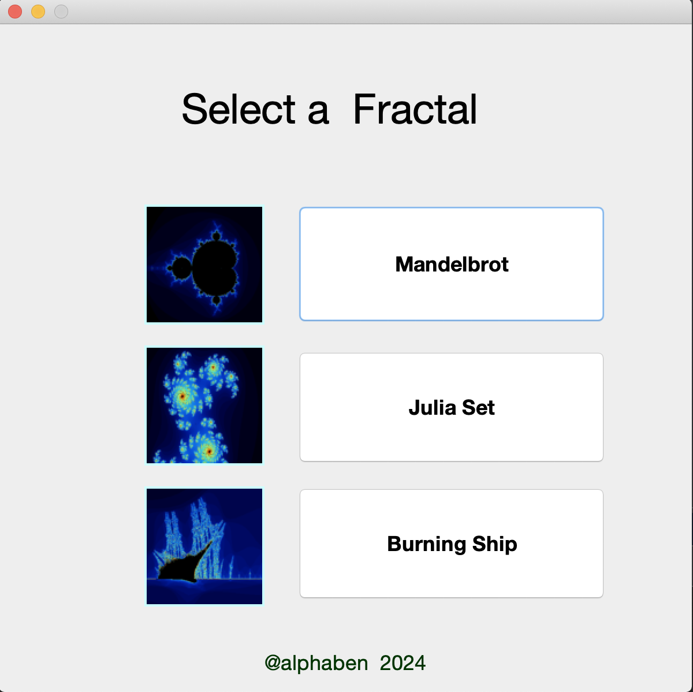
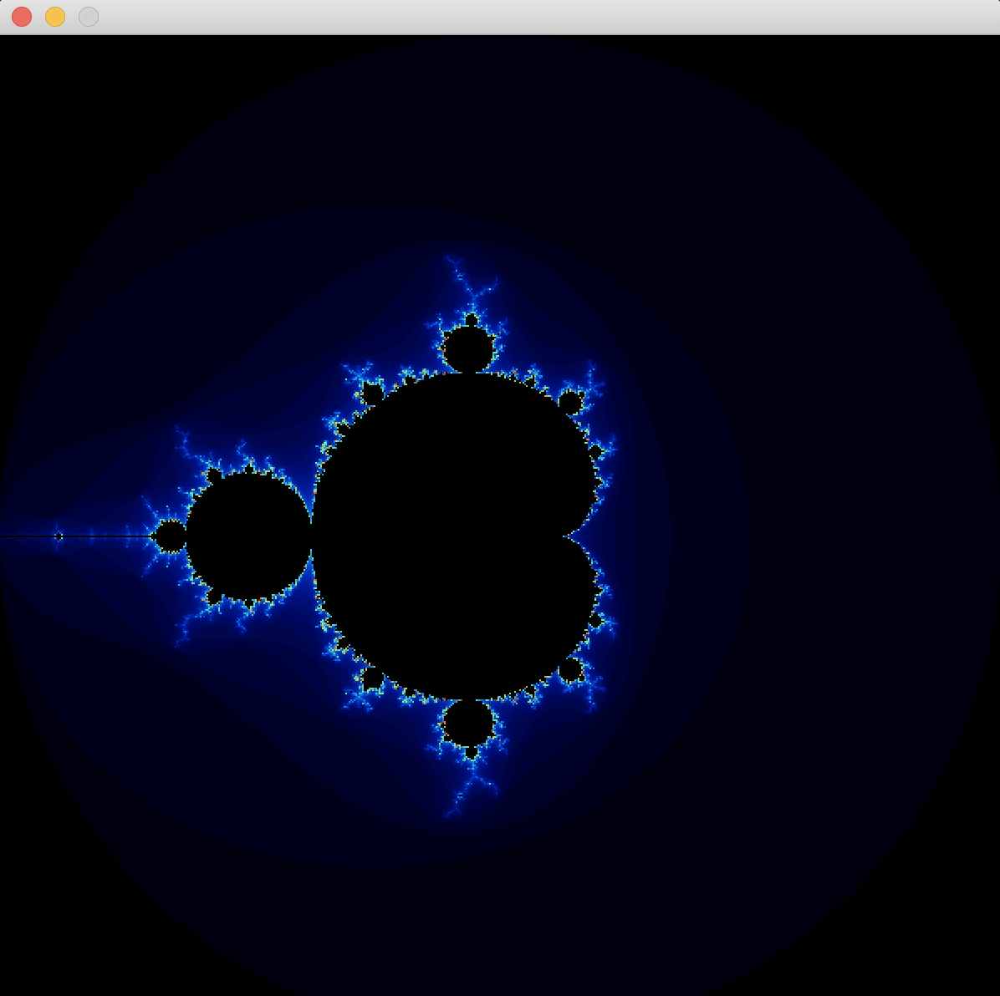
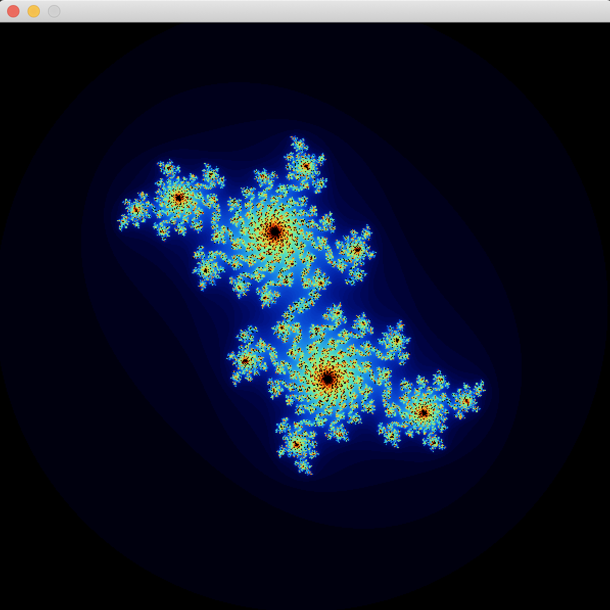
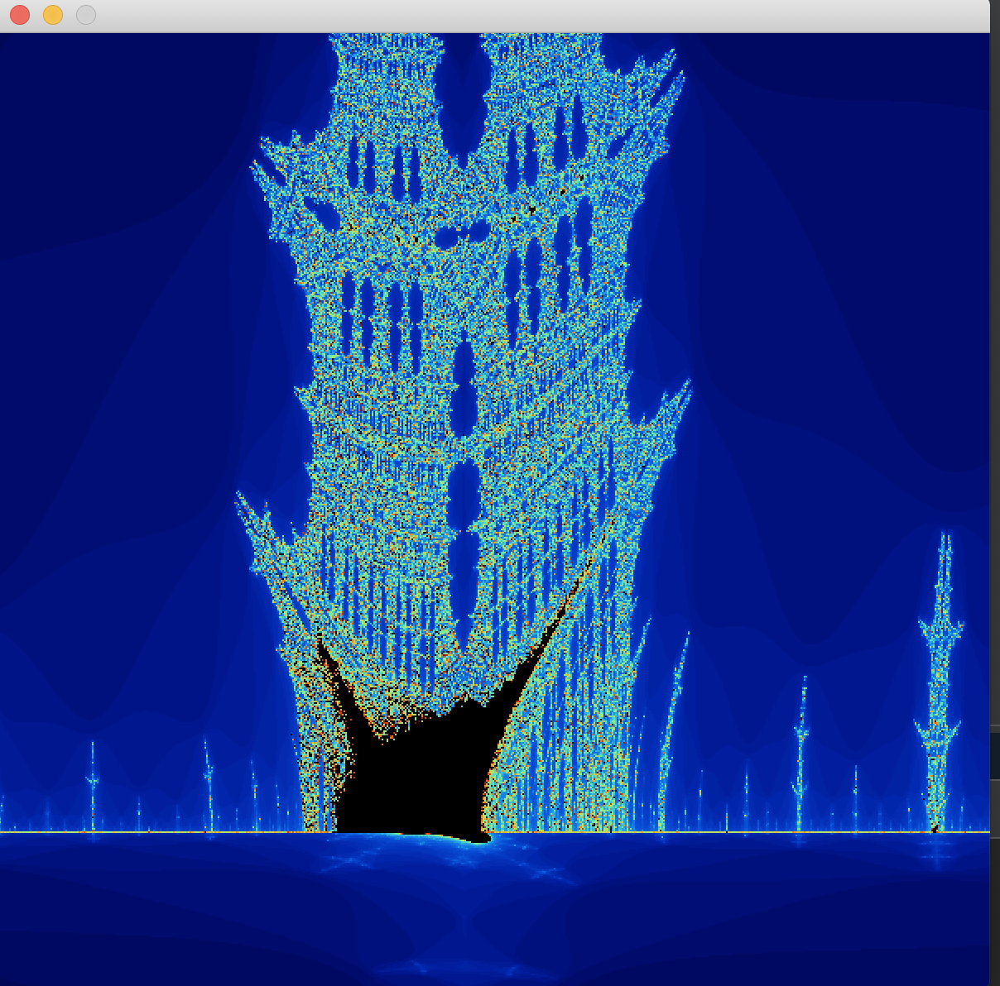

# fractols-java-swing
### IDE 
  this project build with  NetBeans  
## description 
```
this program display a list of fractals like a  mandelbrot, julia set ...

```
## how to use 
  ```bash
  cd ./bin
  java -jar fract-ol.jar
  # use mouse wheel to zoom[in/out]
  # use arrow up/down/left ... to move fractal  
  ```

# menu 


# Mandelbrot


# Julia Set 


# Burning Ship 

